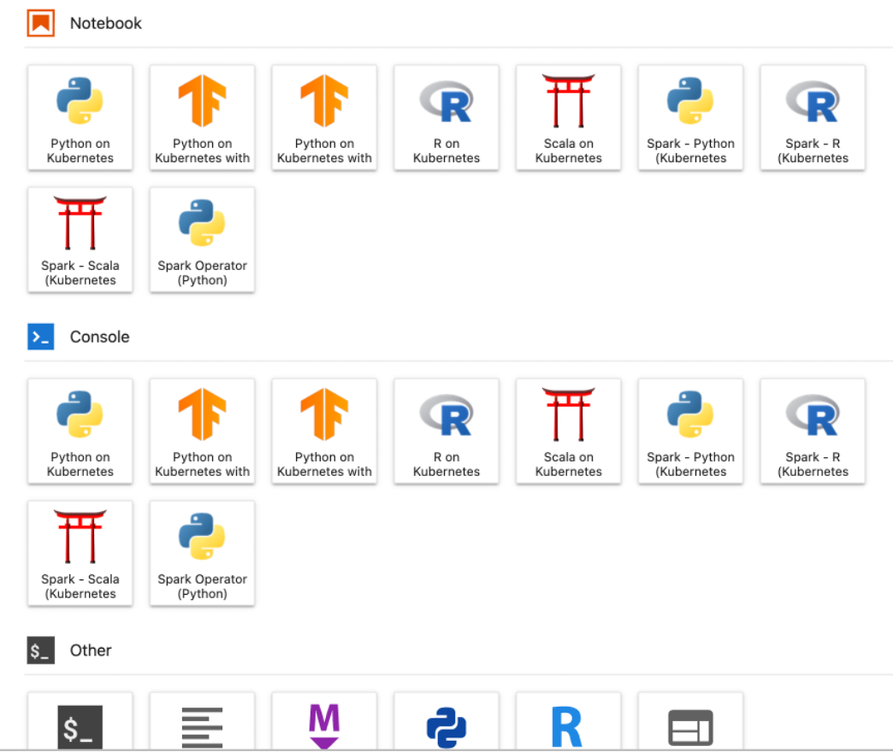

# Jupyter Entreprise Gateway integration

Jupyter Enterprise Gateway is a headless web server (Rest API) and allows to launch kernels on behalf of remote [Jupyter](https://jupyter.org/) Lab, notebooks or self hosted Jupterhub.

The kernels hosted on your jupyter hub/lab are not available and you cannot use them. Only the kernels hosted on the gateway are accessible as shwon below:



## Installation

Install the Entreprise Gateway by issuing the following [helm](https://helm.sh/docs/intro/install/) instruction:

```shell
helm upgrade --cleanup-on-fail --install kdp-enterprise-gateway ../../charts/bricks/enterprise-gateway/helm-0.1.0 \
             --atomic \
             --namespace enterprise-gateway \
             --set authToken="5F06E437-45D6-4B7C-A98F-30B30B2AE606" \
             --set kernelspecs.image=<KERNEL SPEC IMAGE> \
             --create-namespace
```

The `authToken` is an authorization token per gateway instance and used for all requests.

The `<KERNEL SPEC IMAGE>` is built from the [Dockerfile](../../bricks/enterprise-gateway/docker/Dockerfile)

## Integration
### JupyterHub integration

The [profile](jupyterhub-profile/) is an integration samples and you can customize it further. importantly, the profile provide an ability to customize:
* Spark driver image: any spark image with [Gateway support files](https://jupyter-enterprise-gateway.readthedocs.io/en/latest/developers/custom-images.html#requirements-for-custom-kernel-images)
* Driver memory and CPU requests

The spark driver image, memory and CPU settings cannot be customized from the notebook code as these configurations should be provided prior to the JVM startup (notebook execution).

Finally, add your jupyter gateway URL (Load Balancer or Ingress) in the [`kubespawner_override section`](jupyterhub-profile/jupyterhub-profile.yaml#L40) and [`slug:"jupyter-gateway"`](jupyterhub-profile/jupyterhub-profile.yaml#L29):

```yaml
    slug: "jupyter-gateway"
    kubespawner_override:
      jupyter_gateway_url: http://enterprise-gateway.enterprise-gateway.svc.cluster.local:8888
```

Install or update your existing jupyterhub by issuing the following instructions:

```shell
helm repo add jupyterhub https://jupyterhub.github.io/helm-chart/
helm repo update
```

```shell
helm upgrade --cleanup-on-fail --atomic \
      --install jupyterhub jupyterhub/jupyterhub \
      --create-namespace \
      --version 3.2.1 \
      -n jupyterhub \
      --values jupyterhub-profile/jupyterhub-profile.yaml \
      --set-file hub.extraConfig.jupyter_gateway_config\\.py=jupyterhub-profile/jupyter_gateway_config.py \
      --set-file hub.extraFiles.jupyter_gateway_form.stringData=jupyterhub-profile/jupyter_gateway_form.html
```


### Jupyter Lab/notebook integration

```shell
docker run -p 8888:8888 jupyter/minimal-notebook:x86_64-2023-10-20 jupyter lab \
   --gateway-url https://<JUPYTER_GATEWAY_ADDRESS> \
   --GatewayClient.auth_token=<JUPYTER_GATEWAY_AUTH_TOKEN> \
   --GatewayWebSocketConnection.kernel_ws_protocol="" \
   --GatewayClient.request_timeout=600
```

Navigate to `localhost:8888/lab?token=...`

## Authentication

:warning: Jupyter Enterprise Gateway does not currently perform user authentication but, instead, assumes that all users issuing requests have been previously authenticated. An authentication reverse proxy should be deployed for external access.

